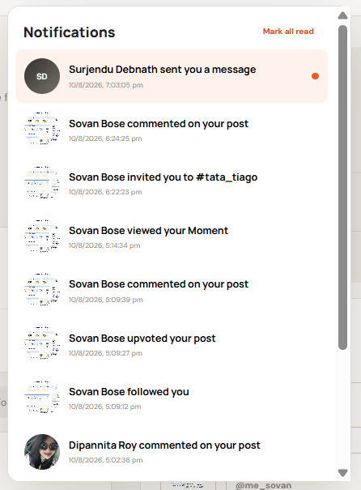
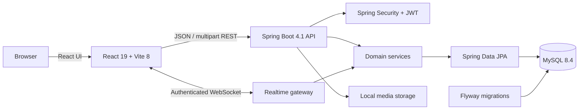

<div align="center">

# Carta<span style="color:#f4511e">Laap</span>

### Built for people who live for the road.

**A full-stack social platform where automobile enthusiasts share builds, solve problems, publish stories, find their crew, and discover their next machine.**

<p>
  
  
  
  
  
  
</p>


</div>

---

## The product

CartaLaap brings the different sides of automobile culture into one focused experience. A member can publish a quick update, write a detailed technical article, join a vehicle-specific room, message another enthusiast, list a car or part for sale, and document the vehicles in their personal garage—all without leaving the platform.

The interface uses a restrained black, warm white, and road-orange visual system. Desktop layouts prioritize information density, while dialogs and master-detail experiences adapt for smaller screens.

### What makes it more than a feed

| Area | Experience |
| --- | --- |
| **Social feed** | Text and image posts, comments with images, upvotes/downvotes, filters, sharing, and ephemeral Moments |
| **Open Road Journal** | Long-form articles with topics, cover art, unlimited inline images, rich formatting, preview, and dynamic trending topics |
| **Communities** | Unique `#room` spaces with discovery, membership, invitations, group chat, image sharing, replies, and live polls |
| **Private garage** | Realtime direct messages with online presence, typing indicators, unread counts, read receipts, and message deletion |
| **Marketplace** | Searchable vehicle/part listings, category and price filters, saved items, listing ownership tools, and safety guidance |
| **Identity & network** | Editable profiles, profile photos, personal vehicle garages, follow relationships, discovery, and blocking controls |
| **Activity** | Notifications for messages, comments, follows, votes, room invitations, and Moment views |

---

## Product tour

### 01 · Frictionless onboarding

Account creation and sign-in live in focused modal experiences. Authentication accepts a username or email, passwords are stored with BCrypt, and the API issues signed JWT access tokens. Browser authentication is kept per tab, making it convenient to test two realtime users side by side.

<table>
  <tr>
    <td width="50%" align="center"><br><sub><b>Returning-member login</b></sub></td>
    <td width="50%" align="center"><br><sub><b>New-member registration</b></sub></td>
  </tr>
</table>

### 02 · A social feed built around the journey

Members can publish text or image updates, browse all posts or posts from people they follow, react with upvotes and downvotes, and continue the conversation in comments. Comments support text, an image, or both. Moments offer a lightweight way to share short-lived updates, while suggested members and dynamic article trends keep discovery close to the feed.


<p align="center"><sub><b>Image-enabled discussions, voting, and sharing beneath every post.</b></sub></p>

### 03 · Long-form stories with a real authoring workflow

The Open Road Journal is designed for guides, reviews, build diaries, and ownership stories. Authors select an existing topic or create a new one, then compose with H1–H3 headings, bold and italic text, quotes, lists, inline code, links, dividers, a cover image, and any number of inline images. Preview mode lets writers check the final reading experience before publishing.

Topics belong only to articles. The trending panel is calculated from published article counts and automatically changes as articles are created or removed.

<table>
  <tr>
    <td width="50%" align="center"><br><sub><b>Curated article discovery</b></sub></td>
    <td width="50%" align="center"><br><sub><b>Rich article editor and topic selection</b></sub></td>
  </tr>
</table>

### 04 · Community rooms for every kind of enthusiast

Communities are unique, normalized spaces displayed with a leading `#`—for example, `#tata_tiago`. Members can discover or create rooms, join and leave, invite other users, share images, reply to a message or image, and hold polls with two to six options. Each member has one vote per poll and can change it; stored totals update live for connected room members.


<table>
  <tr>
    <td width="50%" align="center"><br><sub><b>Group chat, images, replies, invitations, and members</b></sub></td>
    <td width="50%" align="center"><br><sub><b>Persistent, live-updating community polls</b></sub></td>
  </tr>
</table>

### 05 · A community-powered marketplace

The marketplace supports cars, motorcycles, parts, and accessories. Members can search, filter by category and price, sort results, save interesting listings, and manage their own inventory. Listing owners can edit, mark an item sold, or delete it; detail views combine a media gallery, structured vehicle data, seller identity, and a visible safety reminder.

<table>
  <tr>
    <td width="50%" align="center"><br><sub><b>Search, filters, saved listings, and seller tools</b></sub></td>
    <td width="50%" align="center"><br><sub><b>Detailed listing view and media gallery</b></sub></td>
  </tr>
</table>

### 06 · Connections and realtime private conversations

The Connections workspace separates followers, following, discovery, and blocked accounts. Blocking removes follow relationships in both directions and prevents new follows or private messages until the block is removed.

Direct messages use REST for durable history and an authenticated WebSocket for instant delivery. The live layer carries online presence, typing state, read receipts, deletions, and unread badges without putting the JWT in the URL.


<table>
  <tr>
    <td width="50%" align="center"><br><sub><b>Conversation inbox and unread state</b></sub></td>
    <td width="50%" align="center"><br><sub><b>Presence, read receipts, and realtime delivery</b></sub></td>
  </tr>
</table>

### 07 · Profiles, personal garages, and activity

Every member has an editable identity with a display name, bio, location, vehicle interests, and profile image. The personal garage records owned vehicles with structured specifications, multiple images, modifications, and an ownership story. Notifications bring together important activity across the entire platform.

<table>
  <tr>
    <td width="67%" align="center"><br><sub><b>Profile controls and the personal garage</b></sub></td>
    <td width="33%" align="center"><br><sub><b>Unified activity notifications</b></sub></td>
  </tr>
</table>

### 08 · A brand with a point of view

The About page communicates the product vision in the same editorial design language as the rest of the experience: CartaLaap is a place to share the journey, learn together, and build a crew around the machines and roads people care about.


---

## Feature map

- **Accounts:** registration, login by username or email, JWT sessions, BCrypt password hashing
- **Feed:** create/edit/delete posts, image uploads, following feed, voting, sharing
- **Comments:** text and image comments with owner editing and deletion
- **Moments:** create, view, track views, and remove ephemeral updates
- **Articles:** topic-aware publishing, cover images, inline media, rich formatting, previews, dynamic trends
- **Communities:** discovery, creation, membership, invitations, group messaging, images, replies, and polls
- **Messaging:** durable conversations plus realtime delivery, presence, typing, receipts, deletion, and unread badges
- **Marketplace:** browse, search, filter, sort, save, report, and manage listing status
- **Connections:** followers, following, people discovery, suggestions, and two-way blocking rules
- **Profiles:** profile images, public member details, follower statistics, and editable vehicle interests
- **Garage:** vehicle specifications, build notes, ownership stories, and multi-image galleries
- **Notifications:** unread counts and activity events across social, messaging, Moments, and communities
- **Media:** authenticated JPEG, PNG, and GIF uploads up to 10 MB

---

## Architecture



### Technology stack

| Layer | Technology | Responsibility |
| --- | --- | --- |
| Client | React 19, Vite 8, CSS | Responsive SPA, UI state, uploads, REST and WebSocket clients |
| API | Java 21, Spring Boot 4.1, Spring MVC | Validation, domain workflows, REST resources, error handling |
| Security | Spring Security, OAuth2 Resource Server, Nimbus JWT, BCrypt | Stateless authorization, HS256 tokens, password hashing |
| Realtime | Spring WebSocket | Messages, communities, presence, typing, reads, deletes, poll updates |
| Persistence | Spring Data JPA, MySQL 8.4 | Relational storage and transactional domain operations |
| Schema | Flyway | Versioned migrations from accounts and posts through community polls |
| Operations | Actuator, Docker Compose | Health checks and reproducible local database startup |

### Data and realtime design

- The REST API is the source of truth for persisted content; WebSocket events keep connected clients synchronized.
- JWTs are passed to the WebSocket handshake as a subprotocol instead of a query-string credential.
- Flyway owns schema evolution and Hibernate runs in `validate` mode, preventing accidental schema drift.
- Uploaded development media is stored under the ignored `uploads/images` directory.
- Article topics and regular feed posts are deliberately separate domain concepts.
- Community messages, replies, images, polls, options, and member votes remain durable in MySQL.

---

## Run locally

### Prerequisites

- Java 21
- Node.js 22 and npm
- Docker Desktop **or** a local MySQL 8.x server

### 1. Configure the environment

From the project root, create your local environment file:

```powershell
Copy-Item .env.example .env
```

Then update `.env` with your local database password and a private JWT secret. Keep `.env` uncommitted.

| Variable | Purpose | Example |
| --- | --- | --- |
| `DB_USERNAME` | MySQL account used by Spring Boot | `root` |
| `DB_PASSWORD` | Password for that MySQL account | `your-local-password` |
| `JWT_SECRET` | HMAC signing key; use at least 32 random characters | `replace-with-a-long-random-secret` |
| `MYSQL_DATABASE` | Database created by Compose | `cartalaap` |
| `CORS_ALLOWED_ORIGINS` | Comma-separated browser origins | `http://localhost:5174` |
| `UPLOAD_DIR` | Local root for uploaded media | `uploads` |

The API also accepts `DB_URL` and `SERVER_PORT` if you need non-default infrastructure.

### 2. Start MySQL

Use the included Compose service:

```powershell
docker compose up -d mysql
```

If you already run MySQL locally, ensure it is reachable on port `3306`; the application can create the `cartalaap` database on first connection.

### 3. Start the Spring Boot API

```powershell
.\run-server.ps1
```

The wrapper loads `.env`, runs Flyway migrations, and starts the API at `http://localhost:8080`.

Check readiness at [`http://localhost:8080/actuator/health`](http://localhost:8080/actuator/health).

### 4. Start the React client

Open a second terminal:

```powershell
Set-Location client
npm.cmd install
npm.cmd run dev
```

Open [`http://localhost:5174`](http://localhost:5174). Vite uses a strict port so a conflicting process produces an explicit error instead of silently choosing another URL.

> The client defaults to `http://localhost:8080/api`. Set `VITE_API_URL` when the API is hosted elsewhere.

---

## API surface

All protected endpoints expect `Authorization: Bearer <token>`. Public reads are available for the feed, articles, topics, member profiles, Moments, marketplace listings, and public garages.

| Domain | Base routes | Highlights |
| --- | --- | --- |
| Authentication | `/api/auth/*` | Register and log in |
| Members | `/api/users/*` | Profiles, search, suggestions, follow, block |
| Feed | `/api/posts/*`, `/api/comments/*` | Posts, following feed, comments, votes |
| Journal | `/api/articles/*`, `/api/topics/*` | Rich articles, author topics, trending topics |
| Communities | `/api/communities/*` | Rooms, membership, invitations, messages, polls |
| Messaging | `/api/conversations/*`, `/api/messages/*` | Conversation history, sends, deletion |
| Moments | `/api/moments/*` | Active Moments, views, deletion |
| Marketplace | `/api/marketplace/*` | Listings, filters, favorites, status, reports |
| Garage | `/api/garage/*` | Public garages and vehicle management |
| Activity | `/api/notifications/*` | Notification list, unread count, read state |
| Media | `/api/media/images` | Authenticated multipart image uploads |

<details>
<summary><b>Core route reference</b></summary>

| Method | Route | Access |
| --- | --- | --- |
| `POST` | `/api/auth/register` | Public |
| `POST` | `/api/auth/login` | Public |
| `GET/PATCH` | `/api/users/me` | Authenticated |
| `GET` | `/api/users/search`, `/api/users/suggestions`, `/api/users/{username}` | Public or personalized |
| `POST/DELETE` | `/api/users/{username}/follow` | Authenticated |
| `POST/DELETE` | `/api/users/{username}/block` | Authenticated |
| `GET/POST` | `/api/posts` | Public read / authenticated write |
| `PATCH/DELETE` | `/api/posts/{postId}` | Owner |
| `GET/POST` | `/api/posts/{postId}/comments` | Public read / authenticated write |
| `PUT` | `/api/posts/{postId}/vote` | Authenticated |
| `GET/POST` | `/api/articles` | Public read / authenticated write |
| `GET/PATCH/DELETE` | `/api/articles/{articleId}` | Public read / owner mutation |
| `GET` | `/api/topics`, `/api/topics/trending`, `/api/topics/{slug}` | Public |
| `POST` | `/api/topics` | Authenticated |
| `GET/POST` | `/api/communities`, `/api/communities/mine` | Authenticated |
| `POST/DELETE` | `/api/communities/{slug}/join`, `/api/communities/{slug}/leave` | Authenticated |
| `GET/POST` | `/api/communities/{slug}/messages` | Community member |
| `POST` | `/api/communities/messages/{messageId}/poll/vote` | Community member |
| `GET/POST` | `/api/conversations`, `/api/conversations/{id}/messages` | Conversation member |
| `GET/POST/DELETE` | `/api/moments/*` | Public read / authenticated mutation |
| `GET/POST/PATCH/DELETE` | `/api/marketplace/*` | Public browse / authenticated mutation |
| `GET/POST/PATCH/DELETE` | `/api/garage/*` | Public read / owner mutation |
| `GET/POST` | `/api/notifications/*` | Notification owner |
| `POST` | `/api/media/images` | Authenticated |

</details>

### Realtime endpoint

`/ws/messages` is the authenticated WebSocket endpoint. The client negotiates the `cartalaap` subprotocol and supplies the JWT as the second requested protocol. The same gateway fans out direct-message and community events to the relevant connected members.

---

## Project structure

```text
CartaLaap/
├── client/                         # React + Vite frontend
│   ├── src/
│   │   ├── App.jsx                 # Product UI and client workflows
│   │   ├── App.css                 # Responsive visual system
│   │   └── main.jsx                # React entry point
│   └── vite.config.js              # Development server on port 5174
├── server/                         # Spring Boot backend
│   ├── src/main/java/com/cartalaap/
│   │   ├── auth/                   # Registration, login, JWT issuance
│   │   ├── post/ comment/ vote/    # Social feed domain
│   │   ├── article/ topic/         # Long-form publishing
│   │   ├── community/ realtime/    # Rooms, polls, and live events
│   │   ├── message/ notification/  # Private conversations and activity
│   │   ├── marketplace/ garage/    # Listings and personal vehicles
│   │   └── config/                 # Security, CORS, and WebSocket setup
│   └── src/main/resources/
│       └── db/migration/            # Flyway V1–V12 schema history
├── Screenshots/                    # Product demonstration gallery
├── compose.yml                     # MySQL 8.4 development service
├── .env.example                    # Safe configuration template
└── run-server.ps1                  # Environment-aware API launcher
```

---

## Quality checks

Run the backend test suite from the project root:

```powershell
.\server\mvnw.cmd -f server\pom.xml test
```

Validate and build the frontend:

```powershell
Set-Location client
npm.cmd run lint
npm.cmd run build
```

The backend test profile uses H2, while the application runtime uses MySQL with Flyway-controlled migrations.

---

## Roadmap

- Expanded integration and browser-level test coverage
- Cursor-based pagination for high-volume feeds and conversations
- Community roles, moderation queues, and reporting workflows
- Production object storage and image transformation
- Deployment profiles, observability, and continuous delivery

---

<div align="center">

### Every vehicle has a story. CartaLaap gives it a garage.

Built with React, Spring Boot, and MySQL for the automobile community.

</div>
